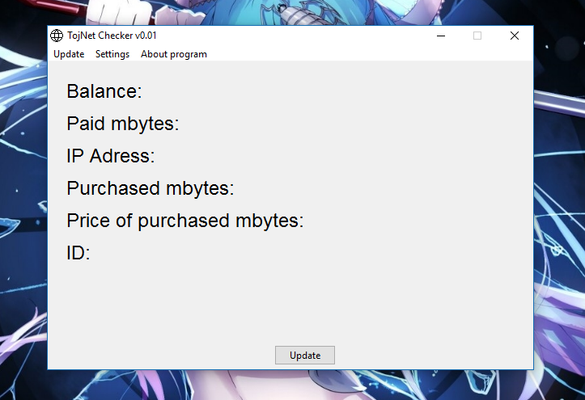
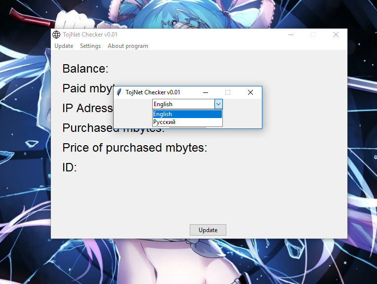
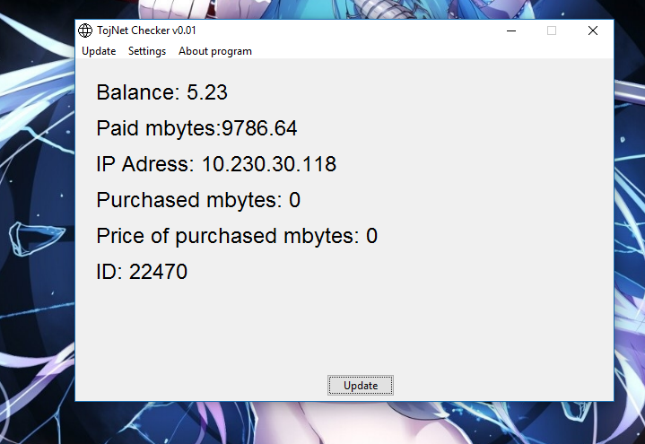
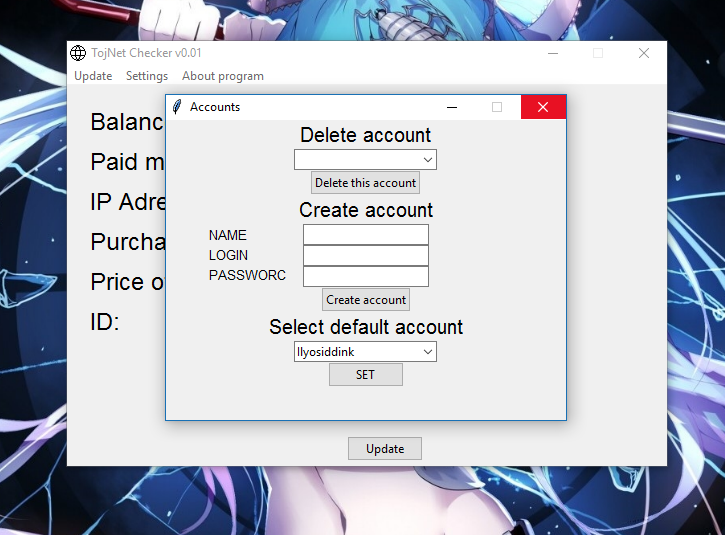

# Tojnet-Checker
Tojnet Checker - A fast traffic checker (tojnet) written with python and sqlite3 database  

## GNU GPL Licensy

## Very useful interface

## 2 Languages

## Very very "Fast" check 

## Multi account system ENABLED :)

## Credits

<b> Python tkinter</b> - <i>for GUI </i>  
<b> Beautiful Soup </b> - <i> used for parsing </i>  
<b> Requests </b> - <i> used create requests to stat.tojnet.tj </i>  
<b> Python Sqlite3 </b> - <i> for connecting to database </i>  

### With love Ilyosiddin Kalandar 
ilyosiddin_kalandar@mail.ru  
<a href="https://t.me/BadLoona">Telegram</a>
